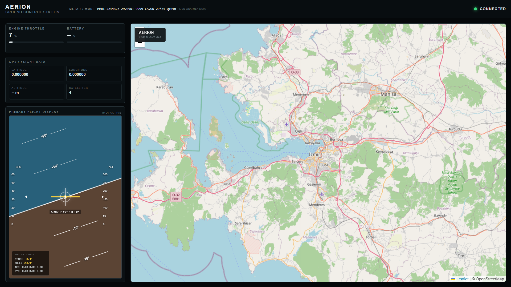
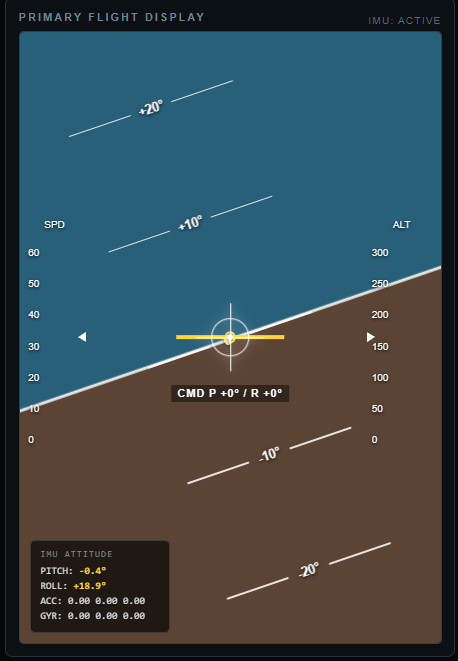
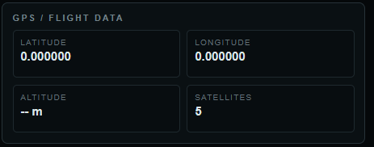
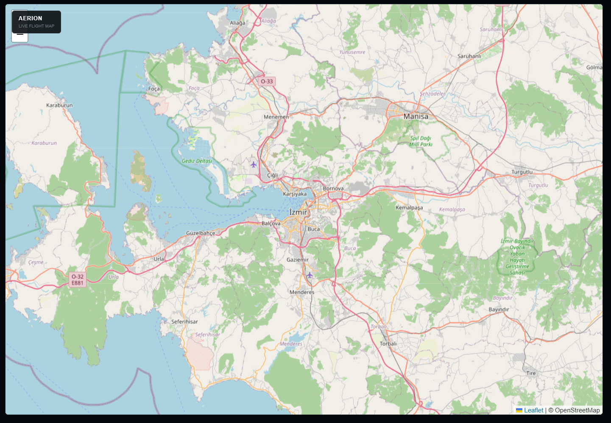
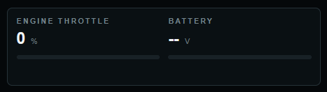
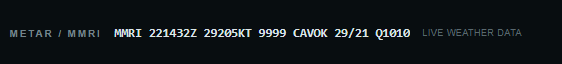

# AERION

<p align="center">
  
</p>

<h3 align="center">
  ESP32-Based Experimental RC Fixed-Wing UAV Platform
</h3>

<p align="center">
  Custom Flight Controller • LoRa Telemetry • GPS • IMU • Ground Control Station
</p>

---

## Overview

**AERION** is an experimental open-source RC fixed-wing UAV platform built around an **ESP32-based flight controller** and a custom **C#/.NET Ground Control Station (GCS)**.

The project combines embedded systems, wireless communication, flight control, telemetry, GPS navigation, sensors and ground control software into a single UAV ecosystem.

The main goal is to develop a complete UAV platform where the hardware, firmware, communication protocol and Ground Control Station are designed as one integrated system.

---

# System Architecture

```text
                         ┌─────────────────────────┐
                         │     Ground Control      │
                         │        Station          │
                         │                         │
                         │  C# / .NET              │
                         │  SharpDX DirectInput    │
                         │  SignalR                │
                         │  Leaflet Map            │
                         └────────────┬────────────┘
                                      │
                                  USB / Serial
                                      │
                                      ▼
                         ┌─────────────────────────┐
                         │       LoRa Module       │
                         │      Ebyte E22900T30D   │
                         └────────────┬────────────┘
                                      │
                                    LoRa
                                      │
                                      ▼
                         ┌─────────────────────────┐
                         │       LoRa Module        │
                         │        Aircraft          │
                         └────────────┬────────────┘
                                      │
                                     UART
                                      │
                                      ▼
                    ┌────────────────────────────────┐
                    │             ESP32               │
                    │                                │
                    │       Flight Controller        │
                    │                                │
                    │  ┌──────────┐  ┌───────────┐  │
                    │  │   GPS    │  │    IMU    │  │
                    │  └──────────┘  └───────────┘  │
                    │                                │
                    │  ┌──────────┐  ┌───────────┐  │
                    │  │ Compass  │  │  BMP280   │  │
                    │  └──────────┘  └───────────┘  │
                    │                                │
                    │       Flight Control          │
                    └──────────────┬─────────────────┘
                                   │
                     ┌─────────────┴─────────────┐
                     │                           │
                     ▼                           ▼
                  ESC / Motor                 Servos
```

---

# Ground Control Station

AERION includes a custom aviation-style **Ground Control Station** developed with C# and .NET.

The GCS provides real-time aircraft telemetry, joystick control, throttle control, attitude visualization, GPS information, live mapping and weather information.

## Full GCS

<p align="center">
  
</p>

### GCS Features

- Real-time telemetry
- Joystick control
- Throttle control
- GPS information
- IMU attitude
- Primary Flight Display
- Live map
- Aircraft position
- Flight mode
- Connection status
- METAR weather information
- Serial communication
- SignalR telemetry
- Joystick hot-plug support
- Automatic joystick reconnection

---

# Primary Flight Display

<p align="center">
  
</p>

The Primary Flight Display provides an aviation-style visualization of the aircraft attitude and control inputs.

### Features

- Artificial horizon
- Pitch ladder
- Roll attitude
- Aircraft reference symbol
- Joystick position
- Command visualization
- IMU pitch
- IMU roll

---

# Navigation & Telemetry

<p align="center">
  
</p>

The telemetry interface displays real-time information received from the aircraft.

### Telemetry

- GPS latitude
- GPS longitude
- Satellite count
- Altitude
- Ground speed
- Course
- HDOP
- Battery information
- IMU pitch
- IMU roll
- Flight mode
- Connection state

---

# Live Navigation Map

<p align="center">
  
</p>

AERION uses **Leaflet** to display the aircraft's GPS position on a live map.

### Current capabilities

- Real-time aircraft position
- GPS tracking
- Navigation visualization
- Map-based aircraft monitoring

The map is designed to become the foundation for future waypoint and autonomous navigation features.

---

# Engine & Throttle

<p align="center">
  
</p>

Throttle commands are generated from the joystick and transmitted to the aircraft through the LoRa communication link.

```text
Joystick
   │
   ▼
GCS
   │
   ▼
Serial
   │
   ▼
LoRa
   │
   ▼
ESP32
   │
   ▼
PWM
   │
   ▼
ESC
   │
   ▼
Brushless Motor
```

The ESP32 converts the received throttle value into a PWM signal for the ESC.

---

# METAR Weather

<p align="center">
  
</p>

The GCS can display METAR aviation weather information directly in the top navigation bar.

Example:

```text
METAR / MMRI    MMRI 221419Z 29306KT 9999 CAVOK 29/21 Q1010
```

This allows basic aviation weather information to remain visible while operating the Ground Control Station.

---

# Flight Controller

The aircraft flight controller is based on an **ESP32**.

The firmware is responsible for:

- Receiving control commands
- Processing GPS data
- Processing IMU data
- Processing compass data
- Processing barometric data
- Controlling the ESC
- Controlling servos
- Sending telemetry
- Detecting communication loss
- Executing failsafe behavior

---

# LoRa Communication

AERION uses **Ebyte E22900T30D** LoRa modules for communication between the Ground Control Station and the aircraft.

```text
Ground Control Station
          │
          │ USB / Serial
          ▼
     LoRa Module
          │
          │ RF
          ▼
     LoRa Module
          │
          │ UART
          ▼
        ESP32
```

The communication system uses a custom binary packet protocol with packet headers and XOR checksums.

---

# Joystick Command Protocol

The current joystick command packet is **8 bytes**.

```text
┌──────┬──────┬───────┬───────┬──────┬──────────┬──────┬──────────┐
│ 0x25 │ 0x28 │ Pitch │ Roll  │ Yaw  │ Throttle │ Mode │ Checksum │
└──────┴──────┴───────┴───────┴──────┴──────────┴──────┴──────────┘
```

| Byte | Field | Description |
|------|-------|-------------|
| 0 | Header | `0x25` |
| 1 | Header | `0x28` |
| 2 | Pitch | Pitch command |
| 3 | Roll | Roll command |
| 4 | Yaw | Yaw command |
| 5 | Throttle | Throttle `0-255` |
| 6 | Mode | Flight mode |
| 7 | Checksum | XOR checksum |

Checksum:

```text
Pitch XOR Roll XOR Yaw XOR Throttle XOR Mode
```

---

# Telemetry Protocol

Telemetry packets use a separate header:

```text
0x35 0x48
```

Current telemetry packet size:

```text
18 bytes
```

Telemetry contains information including:

- GPS satellites
- Latitude
- Longitude
- IMU pitch
- IMU roll
- Packet checksum

The Ground Control Station validates the checksum before processing the packet.

---

# Failsafe System

AERION includes a communication-loss failsafe.

When valid joystick packets stop arriving for the configured timeout period, the ESP32 automatically enters failsafe mode.

```text
Communication Lost
        │
        ▼
   Timeout Detected
        │
        ▼
   Failsafe Active
        │
        ├── Throttle → 0
        ├── Pitch    → Neutral
        ├── Roll     → Neutral
        └── Yaw      → Neutral
```

This prevents stale joystick commands from remaining active after communication is lost.

---

# Joystick Disconnect & Hot-Plug

The Ground Control Station detects physical joystick disconnection.

When the joystick is removed:

```text
Joystick Removed
       │
       ▼
GCS Detects Failure
       │
       ▼
Joystick Marked Offline
       │
       ▼
Command Packets Stop
       │
       ▼
ESP32 Timeout
       │
       ▼
Failsafe
```

When the joystick is connected again, the GCS automatically attempts to reinitialize it without requiring an application restart.

---

# Hardware

| Component | Model |
|-----------|-------|
| Flight Controller | ESP32 DevKit |
| GPS | TBS M10Q GPS/GLONASS |
| IMU | MPU9250 |
| Compass | QMC5883P |
| Barometer | BMP280 |
| LoRa | Ebyte E22900T30D |
| PDB / BEC | Matek Mini Hub |
| ESC | 40A |
| Motor | A2212 1400KV |
| Propeller | 1045 |
| Battery | 3S 1300mAh 25C LiPo |
| Airframe | Experimental RC Fixed-Wing |
| Approx. Weight | 400–500g |

---

# Pin Configuration

Current firmware pin configuration:

| Device | ESP32 Pin |
|--------|-----------|
| GPS RX | GPIO 16 |
| GPS TX | GPIO 17 |
| LoRa RX | GPIO 25 |
| LoRa TX | GPIO 26 |
| I2C SDA | GPIO 21 |
| I2C SCL | GPIO 22 |
| ESC PWM | GPIO 27 |

Servo pins are configurable according to the airframe configuration.

---

# Power Architecture

The current power system uses the Matek Mini Hub as the main power distribution point.

```text
                  3S LiPo
                     │
                     ▼
              Matek Mini Hub
                     │
          ┌──────────┴──────────┐
          │                     │
          ▼                     ▼
      ESC Power             5V / 3A BEC
                                │
                    ┌───────────┼───────────┐
                    │           │           │
                    ▼           ▼           ▼
                  ESP32        LoRa       Servos
```

The ESP32, LoRa, GPS and servos use the regulated 5V power system.

The ESC's internal BEC is not paralleled with the external BEC.

All components share a common ground.

---

# Firmware

The ESP32 firmware is developed using **PlatformIO** and the Arduino framework.

## Firmware Structure

```text
firmware/
└── ESP32/
    ├── src/
    │   ├── main.cpp
    │   ├── flight_control.cpp
    │   ├── flight_control.h
    │   ├── lora.cpp
    │   ├── lora.h
    │   ├── gps.cpp
    │   ├── gps.h
    │   ├── imu.cpp
    │   ├── imu.h
    │   ├── telemetry.cpp
    │   ├── telemetry.h
    │   ├── wifi_debug.cpp
    │   └── wifi_debug.h
    │
    ├── include/
    ├── lib/
    └── platformio.ini
```

The firmware is separated into modules so that individual components can be developed and tested independently.

---

# Wi-Fi Debugging

AERION supports Wi-Fi based debugging for the ESP32.

Example debug output:

```text
[IMU] ACC: 0.02,-0.01,0.98 | GYRO: 0.12,0.03,-0.05

[GPS] RX/s: 482 | TOTAL: 19342 | SAT: 10
      VALID: YES
      LAT: 36.834200
      LON: 28.243000

[LORA RX] T=127 | AGE=0

[FAILSAFE] AGE=1034 ms
```

This allows the system to be monitored without depending entirely on a physical serial monitor during hardware testing.

---

# Ground Control Software Architecture

The Ground Control Station is built with C# and .NET.

```text
Joystick
   │
   ▼
SerialListenerService
   │
   ├── Joystick Input
   ├── Serial Communication
   ├── Telemetry Parsing
   ├── Checksum Validation
   ├── Joystick Reconnection
   └── Serial Reconnection
           │
           ▼
        SignalR
           │
           ▼
        GCS UI
```

### Technologies

- C#
- .NET
- ASP.NET Core
- SignalR
- SharpDX DirectInput
- JavaScript
- HTML
- CSS
- Leaflet

---

# Repository Structure

```text
AERION/
│
├── README.md
├── LICENSE
├── .gitignore
│
├── firmware/
│   └── ESP32/
│       ├── src/
│       ├── include/
│       ├── lib/
│       └── platformio.ini
│
├── gcs/
│   └── UAV-GroundControl/
│       ├── Hubs/
│       ├── Services/
│       ├── Controllers/
│       ├── Views/
│       └── ...
│
├── hardware/
│   ├── schematics/
│   ├── pcb/
│   └── wiring/
│
└── docs/
    ├── images/
    └── ...
```

---

# Required Software

## Firmware

- Visual Studio Code
- PlatformIO
- ESP32 Arduino Framework

## Ground Control Station

- .NET SDK
- Visual Studio / Rider / VS Code
- Windows
- DirectInput-compatible joystick

---

# Required Hardware

At minimum:

- ESP32 development board
- LoRa transmitter / receiver pair
- GPS module
- IMU
- ESC
- Brushless motor
- Propeller
- Servos
- LiPo battery
- PDB / BEC
- RC fixed-wing airframe

Additional sensors can be added as the project evolves.

---

# Installation

## Clone

```bash
git clone https://github.com/enisertdev/aerion.git
cd aerion
```

---

## Firmware

Open:

```text
firmware/ESP32/
```

with PlatformIO.

Configure the local/private settings and upload the firmware to the ESP32.

---

## Ground Control Station

Open:

```text
gcs/UAV-GroundControl/
```

Restore dependencies:

```bash
dotnet restore
```

Run:

```bash
dotnet run
```

Connect the LoRa serial interface and joystick before starting hardware tests.

---

# Configuration

Private configuration files should not be committed to the repository.

Example:

```text
config.example.h
```

can contain placeholder values:

```cpp
#define WIFI_SSID "YOUR_WIFI"
#define WIFI_PASSWORD "YOUR_PASSWORD"
```

The real configuration remains local and is excluded through `.gitignore`.

---

# Development Status

AERION is an **experimental and actively developing project**.

### Currently Working

- [x] ESP32 flight controller
- [x] LoRa communication
- [x] GPS integration
- [x] IMU integration
- [x] Compass integration
- [x] GCS joystick control
- [x] ESC PWM control
- [x] Telemetry
- [x] Telemetry checksum validation
- [x] Joystick hot-plug detection
- [x] Joystick automatic reconnection
- [x] Serial reconnection watchdog
- [x] Communication failsafe
- [x] Wi-Fi debugging
- [x] Live GPS map
- [x] Primary Flight Display
- [x] METAR display

---

# Roadmap

## Flight Control

- [ ] Servo mixing
- [ ] Stabilized flight
- [ ] PID controller
- [ ] Sensor fusion
- [ ] Automatic level flight
- [ ] Altitude hold
- [ ] Airspeed support
- [ ] Battery monitoring

## Navigation

- [ ] Waypoint navigation
- [ ] Home position
- [ ] Return-to-Home
- [ ] Geofencing
- [ ] Navigation modes
- [ ] Autonomous flight

## Ground Control Station

- [ ] Flight path history
- [ ] Telemetry logging
- [ ] Mission planner
- [ ] Waypoint editor
- [ ] Advanced map overlays
- [ ] RSSI visualization
- [ ] Battery graphs
- [ ] Flight log viewer
- [ ] Aircraft configuration panel

## Communication

- [ ] Improved packet protocol
- [ ] Extended telemetry
- [ ] RSSI telemetry
- [ ] Link quality monitoring
- [ ] Command acknowledgements
- [ ] Packet sequence tracking
- [ ] Communication statistics

---

# Safety

AERION is an experimental UAV project intended for educational and development purposes.

Before testing:

- Remove the propeller during bench testing whenever possible
- Verify failsafe behavior
- Verify servo directions
- Verify throttle direction
- Verify control surface limits
- Verify battery voltage
- Verify LoRa communication
- Verify GPS operation
- Verify IMU orientation
- Verify common ground connections
- Perform a communication range test
- Inspect all wiring and connectors

Never rely solely on software protection.

---

# Project Goals

The long-term goal of AERION is to evolve from an experimental manually controlled RC aircraft into a complete open-source UAV platform.

```text
Embedded Systems
       +
Wireless Communication
       +
Flight Control
       +
Navigation
       +
Telemetry
       +
Ground Control
       +
Autonomous Flight
```

---

# Technology Stack

## Flight Controller

```text
ESP32
C / C++
Arduino Framework
PlatformIO
```

## Communication

```text
LoRa
UART
Custom Binary Protocol
XOR Checksum
```

## Sensors

```text
GPS
MPU9250
QMC5883P
BMP280
```

## Ground Control Station

```text
C#
.NET
ASP.NET Core
SignalR
SharpDX DirectInput
JavaScript
Leaflet
HTML
CSS
```

---

# Screenshots

## Full GCS

<p align="center">
  
</p>

## Primary Flight Display

<p align="center">
  
</p>

## Telemetry

<p align="center">
  
</p>

## Navigation Map

<p align="center">
  
</p>

## Throttle

<p align="center">
  
</p>

## METAR

<p align="center">
  
</p>

---

# License

This project is released under the license included in this repository.

See `LICENSE` for more information.

---

# Author

**enisertdev**

AERION is an experimental personal UAV and embedded systems project.

---

<p align="center">
  <b>AERION</b>
  <br>
  Experimental ESP32 UAV Platform
  <br><br>
  Built from hardware to ground control.
</p>
